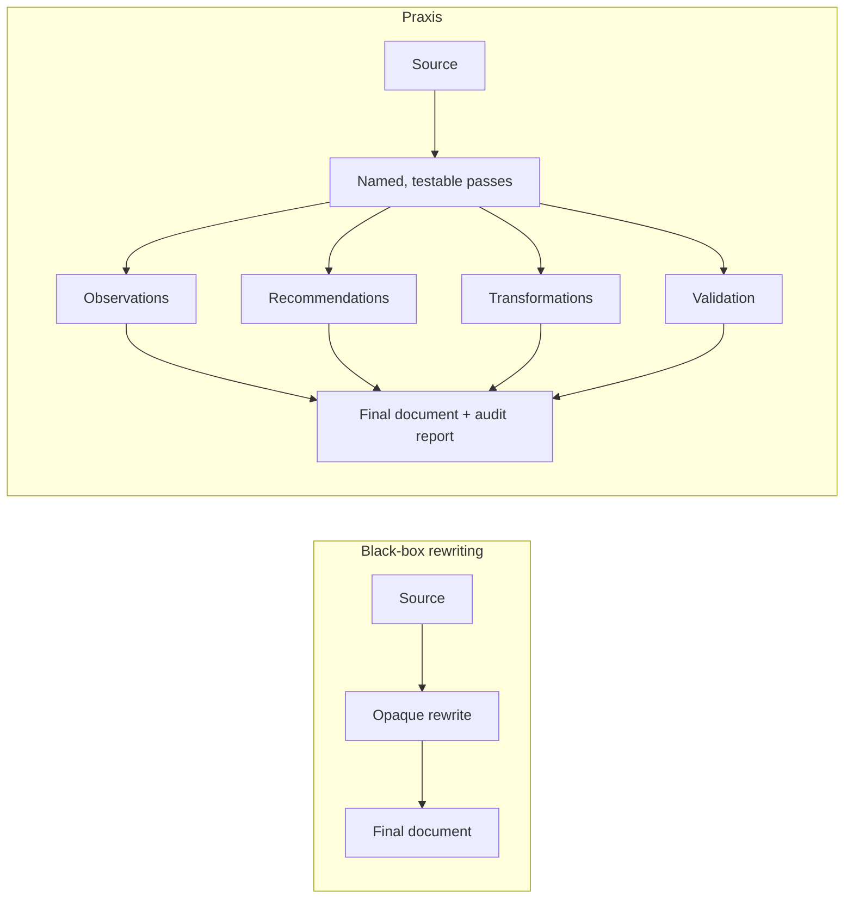
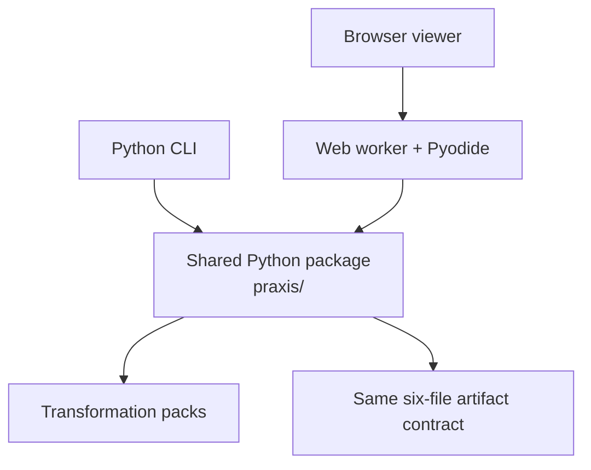

# praxis

> An early reference implementation for transparent, auditable written communication.

Praxis turns document work into an inspectable workflow. Instead of returning only a rewritten document, it records what it observed, what it recommended, which changes it made, and whether protected content survived. That trail makes a transformation reviewable, testable, and portable between the command line and the browser.

Praxis has two layers over one Python engine, and **neither one writes prose**:

| Layer | Question it answers |
|---|---|
| **Transformation harness** | Which mechanical defects can be fixed with evidence, and did protected content survive? |
| **Design layer** | What should this message do for this reader at this level of risk, and does the draft do it? |

The design layer is new and MCP-first — see [Communication design](#communication-design) below, [`VISION.md`](VISION.md) for why it exists, and [RFC-0003](spec/RFC-0003-contextual-communication-design.md) for how it works.

## Try Praxis

Choose either verified entry point:

- **[Open the live viewer](https://dhk.github.io/praxis/)** — paste or upload Markdown, run a transformation pack locally in your browser, inspect every pass, and download the artifacts. No account or backend is involved.
- **Run the local harness from source** — clone this repository and use the Python CLI as described below.

Praxis is an early executable harness, not a finished editor or a published product. There is currently **no PyPI package, npm package, or curl installer**. The browser viewer and a source checkout are the supported ways to try it.

## Why an artifact trail?



The difference is practical: reviewers can trace each edit to evidence, check whether it was applied, inspect validation results, and retain the complete run as files rather than trusting an unexplained before-and-after.

## Install and run from source

Praxis requires Python 3.10 or newer. The editable install below is a source install; it does not download a published Praxis distribution.

```bash
git clone https://github.com/dhk/praxis.git
cd praxis
python3 -m venv .venv
source .venv/bin/activate
python -m pip install --upgrade pip
python -m pip install -e ".[test]"
python -m pytest
```

Run the default Concise Scientific Writing pack and write a complete artifact trail:

```bash
python -m praxis run examples/concise_scientific_writing/input.md --out artifacts/demo
```

Expected final lines include `Validation: pass` and the generated directory contains:

```text
artifacts/demo/
├── observations.json
├── recommendations.json
├── transformations.json
├── validation.json
├── final.md
└── report.md
```

Packs are selected with `--pack`. For example:

```bash
python -m praxis run examples/claude_skill/SKILL.md --pack claude_skill_authoring --out artifacts/skill
```

The `claude_skill_authoring` pack encodes corpus-measured practices from the [skill-map](https://github.com/dhk/skill-map) study of roughly 5,000 crawled Claude skills.

## Communication design

The second layer works above the level of style. Given a communication
situation it recommends a structure and says why, asks only the
questions whose answers would change that recommendation, evaluates a
draft against ten dimensions with the evidence attached, and audits any
alternative versions to prove no figure, commitment, or caveat went
missing.

```bash
python -m praxis design examples/decision_request/input.md \
  --set intent=request --set stakes=high --set time_available=low \
  --set sensitivity=high --set power_distance=upward
```

```text
Bottom line up front (high confidence) · 5 gap(s) at raised stakes — resolve before sending
Structure: Bottom line up front (high confidence)
  gap: outcome_clarity — The intent is 'request' but no request of the reader was found.
  gap: structural_fit — bluf puts the conclusion first; the opening is background.
  gap: risk_calibration — At high stakes the draft lacks: verification, owner.
  gap: relationship_fit — Writing upward with 3 hedges around the ask; deference here
                          reads as uncertainty about the request itself.
  gap: actionability — Present: none. Missing: ask, owner, deadline, verification.
Wrote artifacts/design.html
```

Run the same draft at `--set stakes=low` and most of that disappears —
the same words are fit or unfit depending on the situation, which is the
layer's whole argument. See
[`examples/decision_request/contract.md`](examples/decision_request/contract.md)
for the contrast. Omit the draft entirely to plan before writing.

`--transform` answers a different question: not what is wrong, but what
to change and *where*.

```text
6 located change(s): 3 to insert, 3 to revise. Shape it bottom line up front.

[insert] at 11 (outcome_clarity): State the single action the reader must take,
         in its own sentence at the top. Include the time by which it must happen.
[revise] 418-426 (relationship_fit): Remove this hedge.
    on: 'somewhat'
Folded into another edit: structural_fit -> outcome_clarity, actionability -> outcome_clarity
```

Anything you declare protected is located too, and a change that would
overwrite it comes back marked blocked rather than quietly dropped.
`--voice past-emails.md` adds which of your habits the draft keeps —
semicolons, sentence rhythm, first person — as counts, never as a verdict
about who wrote it. The HTML file is a self-contained
page — contract, strategy, scorecard, and any variants side by side with
their difference maps — with no scripts and no network requests.

Praxis generates no prose here either. It decides the shape, states what
may not move, and checks whatever text comes back. Where prose is
wanted, it comes from whichever model the writer is already using:

```bash
python -m pip install -e ".[mcp]"
python -m praxis mcp        # MCP server on stdio
python -m praxis serve      # browse saved sessions at 127.0.0.1:8765
```

The server exposes `design_open`, `design_update`, `design_detail`,
`design_transform`, `design_shade`, `design_render`, `design_list`, and
`design_schema`.

It is answer-first and conversational. Paste a draft and the first call
answers immediately — there is no interview to get through:

```text
Fix 4 things before sending: no request of the reader; the point is not in
the opening; no verification or owner. Plus 1 more. Shape it bottom line up front.

low confidence · 7 questions would still change this · 9 more findings not shown

? What must they do, decide, or understand afterwards?
```

Answer one, or don't. Each reply offers exactly one more question and
reports what is still outstanding, so stopping is a choice made with the
cost in front of you. Answer enough of them and praxis says the thing
almost no other tool can:

```text
high confidence · nothing else you could tell me would change it · 5 more findings not shown
```

That is not a stock phrase — it falls out of the same perturbation check
that picks the questions. If every remaining unknown lands on the same
strategy, there is genuinely nothing left to ask.

The reasoning, the full ten-dimension scorecard, and the contract are all
one `design_detail` call away, and never volunteered. `praxis design`
behaves the same way, with `--why` as the way down.

## One engine, two interfaces



The CLI imports the Python engine directly. The static viewer loads those same Python source files into Pyodide; it is not a JavaScript rewrite of the rules. Browser documents are processed locally: there are no accounts, application backend, or server-side document uploads. The viewer can download a zip of the same six artifact files written by the CLI. See [Architecture](docs/architecture.md) for the boundaries and data flow, or [Viewer documentation](web/README.md) to build the site locally.

## Current maturity

The first vertical slice proves the pass model, artifact trail, multiple transformation packs, validation loop, CLI, and browser interface. It intentionally does not claim semantic equivalence, comprehensive writing coverage, or production-editor ergonomics. Human review remains necessary, especially for recommendations marked for review.

Design principles:

1. Observe before changing.
2. Require evidence for every transformation.
3. Preserve meaning unless explicitly instructed otherwise.
4. Validate before acceptance.
5. Emit artifacts at every step.
6. Prefer another operation over another prompt.

The full list of product invariants — including *warmer never means less
truthful*, *ask only what changes the answer*, and *no opaque scores* —
is in [`VISION.md`](VISION.md), with the engineering rules that follow
from them in [`AGENTS.md`](AGENTS.md).

## Repository layout

```text
praxis/        Shared Python engine (stdlib only — it also runs in the browser)
praxis/mcp/    Host-side surfaces: MCP server, session store, local viewer
packs/         Human-readable metadata mirrors for transformation packs
examples/      Inputs used for demos and pack-specific validation
tests/         Python regression and artifact-contract tests
web/           Static browser interface and Pyodide worker
scripts/       Viewer build tooling
docs/          Architecture, design documentation, and source research
spec/          RFCs for the engine, viewer, and design layer
```

The engine's modules split by layer: `pipeline`, `rules`, `packs`,
`validation`, `report`, `metrics` are the transformation harness;
`design`, `contract`, `strategy`, `shading`, `evaluate`, `signals`,
`render` are the design layer. `praxis/mcp/` is the only part with a
third-party dependency, and the browser bundle never includes it.

For development setup and change-specific checks, see [CONTRIBUTING.md](CONTRIBUTING.md).
