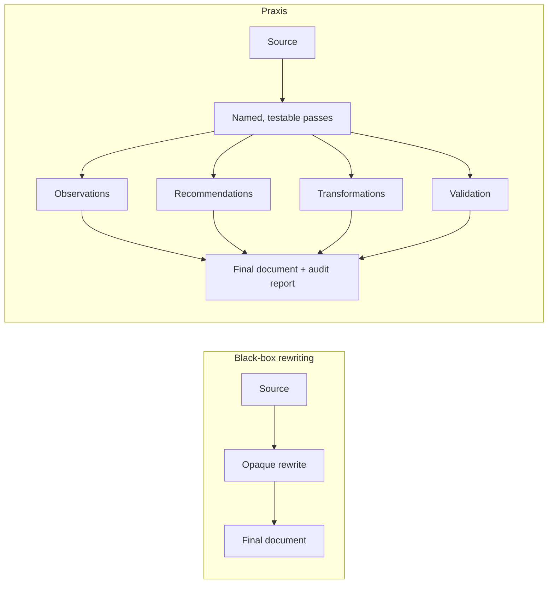
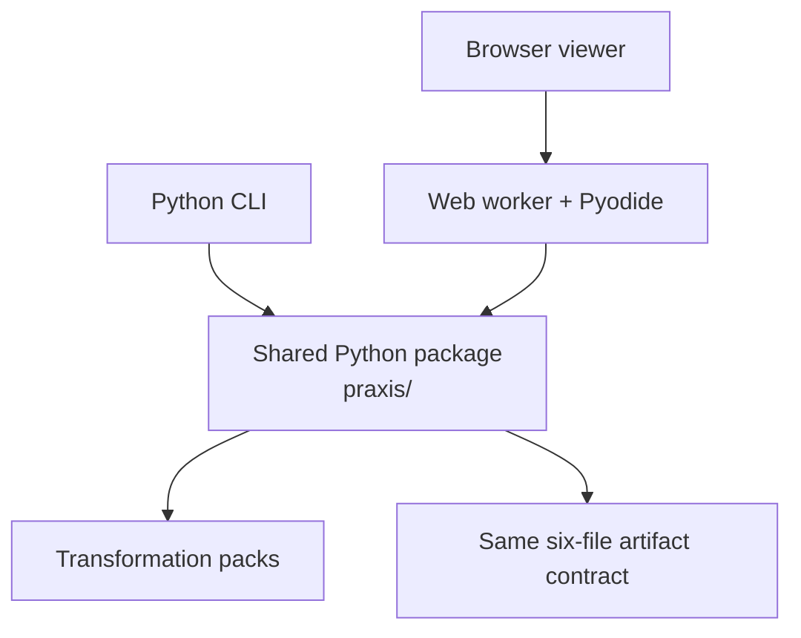

# praxis

> An early reference implementation for transparent, auditable document transformation pipelines.

Praxis turns document improvement into an inspectable workflow. Instead of returning only a rewritten document, it records what it observed, what it recommended, which changes it made, and whether protected content survived. That trail makes a transformation reviewable, testable, and portable between the command line and the browser.

## Try Praxis

Choose either verified entry point:

- **[Open the live viewer](https://dhk.github.io/praxis/)** — paste or upload Markdown, run a transformation pack locally in your browser, inspect every pass, and download the artifacts. No account or backend is involved.
- **Run the local harness from source** — clone this repository and use the Python CLI as described below.

Praxis is an early executable harness, not a finished editor or a published product. There is currently **no PyPI package, npm package, or curl installer**. The browser viewer and a source checkout are the supported ways to try it.

## Why an artifact trail?



The difference is practical: reviewers can trace each edit to evidence, check whether it was applied, inspect validation results, and retain the complete run as files rather than trusting an unexplained before-and-after.

## Install and run from source

Praxis requires Python 3.10 or newer. The editable install below is a source install; it does not download a published Praxis distribution.

```bash
git clone https://github.com/dhk/praxis.git
cd praxis
python3 -m venv .venv
source .venv/bin/activate
python -m pip install --upgrade pip
python -m pip install -e ".[test]"
python -m pytest
```

Run the default Concise Scientific Writing pack and write a complete artifact trail:

```bash
python -m praxis run examples/concise_scientific_writing/input.md --out artifacts/demo
```

Expected final lines include `Validation: pass` and the generated directory contains:

```text
artifacts/demo/
├── observations.json
├── recommendations.json
├── transformations.json
├── validation.json
├── final.md
└── report.md
```

Packs are selected with `--pack`. For example:

```bash
python -m praxis run examples/claude_skill/SKILL.md --pack claude_skill_authoring --out artifacts/skill
```

The `claude_skill_authoring` pack encodes corpus-measured practices from the [skill-map](https://github.com/dhk/skill-map) study of roughly 5,000 crawled Claude skills.

## One engine, two interfaces



The CLI imports the Python engine directly. The static viewer loads those same Python source files into Pyodide; it is not a JavaScript rewrite of the rules. Browser documents are processed locally: there are no accounts, application backend, or server-side document uploads. The viewer can download a zip of the same six artifact files written by the CLI. See [Architecture](docs/architecture.md) for the boundaries and data flow, or [Viewer documentation](web/README.md) to build the site locally.

## Current maturity

The first vertical slice proves the pass model, artifact trail, multiple transformation packs, validation loop, CLI, and browser interface. It intentionally does not claim semantic equivalence, comprehensive writing coverage, or production-editor ergonomics. Human review remains necessary, especially for recommendations marked for review.

Design principles:

1. Observe before changing.
2. Require evidence for every transformation.
3. Preserve meaning unless explicitly instructed otherwise.
4. Validate before acceptance.
5. Emit artifacts at every step.
6. Prefer another operation over another prompt.

## Repository layout

```text
praxis/        Shared Python engine, CLI, models, rules, validation, and reports
packs/         Human-readable metadata mirrors for transformation packs
examples/      Inputs used for demos and pack-specific validation
tests/         Python regression and artifact-contract tests
web/           Static browser interface and Pyodide worker
scripts/       Viewer build tooling
docs/          Architecture and design documentation
spec/          Early RFCs for the engine and viewer
```

For development setup and change-specific checks, see [CONTRIBUTING.md](CONTRIBUTING.md).
