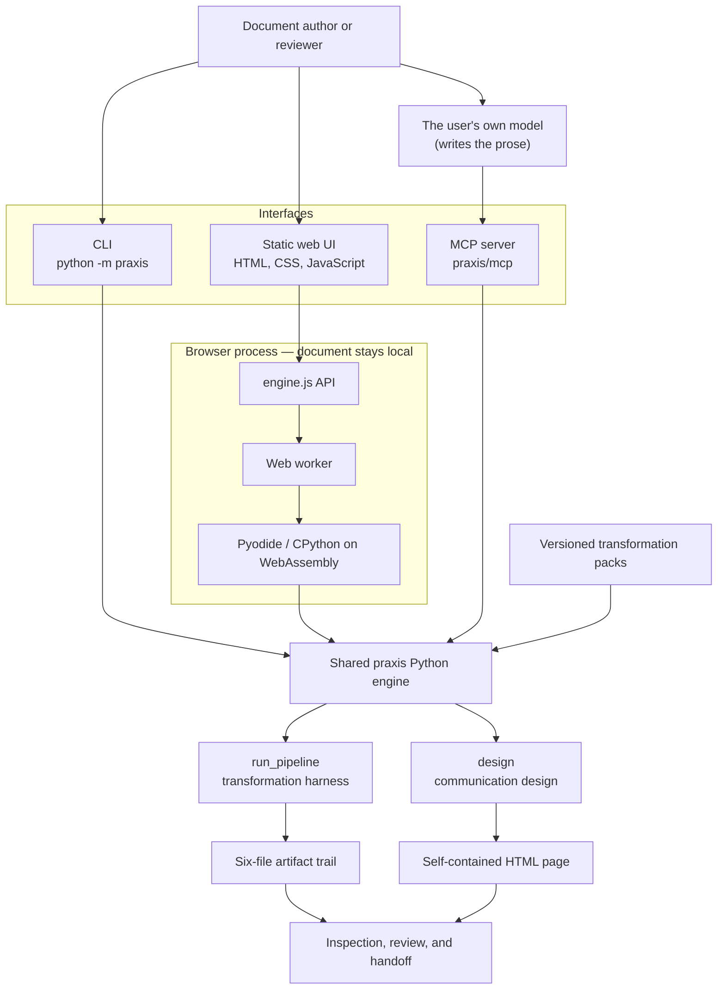
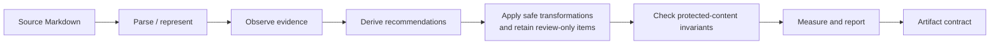

# Architecture

Praxis is one repository and one Python engine, carrying two layers and exposed through three interfaces: a command-line harness, a static browser viewer, and an MCP server. Keeping them together makes each interface evidence of the engine's real behavior and gives them all the same artifact contract.

The two layers answer different questions and share nothing but the engine's discipline:

| Layer | Entry point | Question |
|---|---|---|
| Transformation harness (RFC-0001) | `pipeline.run_pipeline(text, pack_id)` | Which mechanical defects can be fixed with evidence, and did protected content survive? |
| Communication design (RFC-0003, RFC-0004) | `design.design(draft, contract, variants, mode)` | What should this message do for this reader at this level of risk, does the draft do it, and — in `transform` mode — what should change, where? |

Neither layer generates prose, and neither reaches a model or the network. The design layer's prose comes from the client's own model over MCP; praxis supplies the strategy and the audit.

## System view

The MCP path is the one worth reading twice. The client's model writes
prose and hands it back; praxis checks it against constraints the
contract declared beforehand. Praxis itself never calls that model, or
any other — which is what makes the check independent of the thing it is
checking.

The CLI reads and writes local files. The deployed viewer is static and executes the packaged Python source inside the user's browser. Praxis has no application server, account system, database, telemetry pipeline, or document-upload endpoint. Hosting serves the application assets, and the page requests its display font from Google Fonts; neither request includes document contents. The first local build downloads the pinned Pyodide runtime. Document processing itself stays inside the browser boundary.

## Pipeline and data flow

`praxis.pipeline.run_pipeline(text, pack_id)` is the shared orchestration boundary. It selects a pack, invokes named operations, and returns a JSON-serializable result. Persistence belongs to each interface: the CLI writes a directory, while the browser renders the result and can create a downloadable zip.

## Components and boundaries

| Component | Responsibility | Boundary |
| --- | --- | --- |
| `praxis/pipeline.py` | Orchestrates one complete run and returns its result. | Contains no CLI, browser, or persistence concerns. |
| `praxis/packs.py` and `praxis/rules.py` | Define pack registry behavior; observe, recommend, and transform. | Packs select domain rules; the interfaces do not duplicate them. |
| `praxis/validation.py` | Checks protected tokens and applies explicit validation status. | Provides conservative evidence, not proof of semantic equivalence. |
| `praxis/report.py` and `praxis/metrics.py` | Produce review-facing reports and before/after measurements. | Consume pipeline results; they do not decide edits. |
| `praxis/cli.py` | Reads an input path and writes artifact files. | Thin adapter over `run_pipeline` and `design`. |
| `praxis/contract.py` | The communication contract: fields, closed domains, types, provenance. | Data only; it selects nothing itself. `SELECTORS` is "has a closed domain", which is not the same as `strategy.STRATEGY_INPUTS` ("a rule reads it"). |
| `praxis/strategy.py` | Scores structures against a contract and computes which questions are material. | Generic over the `Structure` table; adding a structure never touches the scorer. |
| `praxis/shading.py` | Decides whether variants are warranted, extracts invariants, checks a variant, and builds its difference map. | Reads contracts, never strategies. |
| `praxis/evaluate.py` | Ten fit dimensions, each with evidence and an honest `unknown`. | Reports; it never rewrites and emits no score. |
| `praxis/signals.py` | Conservative text detectors shared by evaluation and shading. | Recall-oriented: a miss is `unknown`, never `absent`. |
| `praxis/spans.py` | Where things are: detector matches, sentences, paragraphs, protected phrases, the body start. | Positional only. Protected phrases match across line wrapping. |
| `praxis/transform.py` | Turns each gap into a located edit, and checks it against protected content first. | Emits instructions, never prose. Every gap is addressed, folded, or named. |
| `praxis/voice.py` | Which of the writer's countable habits a rewrite kept. | Habits, not authorship; never returns a `gap`. |
| `praxis/design.py` | Orchestrates one design session and returns its result. | The single boundary all three interfaces consume. |
| `praxis/brief.py` | Renders a design result as text at four depths, shallowest first. | Presentation only; it decides how much to say, never what is true. |
| `praxis/render.py` | Renders a design result as a self-contained HTML page. | Pure string building; it can only show what the engine computed. |
| `praxis/mcp/server.py` | The MCP tool surface and the loop it walks a client through. | The only place a client model receives instructions. |
| `praxis/mcp/store.py` | Session persistence: contract, draft, variants. | Stores nothing derived, so no verdict can go stale. |
| `praxis/mcp/serve.py` | A loopback HTML viewer for saved sessions. | Read-only; not an application server. |
| `web/src/engine.js` | Presents `runPipeline` and zip-download operations to the UI. | Keeps Pyodide details out of the rest of the UI. |
| `web/src/worker.js` | Loads the Python package in Pyodide and runs it off the UI thread. | The browser/Python bridge; it must preserve the CLI artifact contract. |
| `scripts/build_site.sh` | Assembles the static site, Python sources, examples, and pinned Pyodide runtime. | Build-time packaging only; it is not an application backend. |

## Implementation notes

Detail below elaborates specific components from the table above; it's
the operational "why it's built this way," not a second architecture
description.

- **`web/sw.js` (service worker) uses stale-while-revalidate, not
  cache-first.** Every request is answered from cache immediately, but a
  network fetch always runs in the background and refreshes the cache.
  A pure cache-first strategy (what shipped originally) meant a returning
  visitor could get stuck on an old deploy indefinitely, since the
  service worker only re-precaches when its own file's bytes change. Bump
  the `CACHE` version string on any change to this file.
- **`web/src/main.js` is a single-file, dependency-free UI**: one `state`
  object, one `render()` dispatcher keyed on `state.step` (1-7), no
  framework. Each pass panel (`renderInput`, `renderObserve`, ...
  `renderCompare`) fully replaces `panelEl.innerHTML` and re-attaches its
  own listeners on every render — panels never diff or persist DOM
  between renders, only `state` persists. The six passes mirror the
  harness's stages 1:1; step 7 (Compare) is viewer-only.
- **`web/src/markdown.js`** is a deliberately minimal Markdown renderer
  (headings, paragraphs, tables, fenced code, inline emphasis/links) — no
  lists, no blockquotes. `splitReportSections` (in `main.js`) splits the
  Report panel into tabs only on the four exact section titles `report.py`
  emits (`Metrics`, `Validation`, `Transformation Diff Log`,
  `Final Document`) — never on any `##` — because the embedded final
  document can itself contain user H2 headings (a resume's
  `## Experience`) that must stay inside the Final Document tab rather
  than being mistaken for a new report section.
- **A `Pack` is pure data — the extension point, and the only place a new
  pack should touch.** `packs.py` defines three frozen dataclasses:
  - `PhraseRule(id, title, pattern, replacement, reason, safety="safe")`
    — rewrite rules, matched with `re.IGNORECASE` and applied
    automatically. `safety` is `safe` or `low_risk`.
  - `FlagRule(id, title, reason, action, kind="regex", pattern="",
    threshold=0)` — observation-only, never edits anything, and always
    recorded as `safety="review"` regardless of what the rule says.
    `kind="regex"` matches `pattern` with `IGNORECASE | MULTILINE`
    (`rules.py`'s `FLAG_REGEX_FLAGS` — note the phrase rules above use
    `IGNORECASE` alone); `kind="long_sentence"` instead flags sentences
    over `threshold` words and formats `reason` with the actual count
    via `{words}`.
  - `Pack(id, version, title, phrase_rules, flag_rules)`. Rule IDs may
    legitimately repeat across rules that share a title, which is why
    `rule_count()` counts distinct IDs rather than tuple length.

  `rules.py` is generic over all of this, so a new pack is a new `Pack`
  in `packs.py` and nothing else.
- **Each pack's `packs/<id>/pack.yaml`** is a human-readable metadata
  mirror of the `Pack` defined in `packs.py` — not read by the code, kept
  in sync by hand. See the Non-goals note below: this is deliberate, not
  a gap.
- **The worker computes the word-level diff and the artifact zip in
  Python, not JS** — `web/src/worker.js` imports `difflib` and `zipfile`
  from the Pyodide runtime. Neither is reimplemented in JavaScript, and
  neither should be: the diff shown in the Compare panel and the zip a
  visitor downloads have to match what the CLI would produce, which is
  the same reason `worker.js` is the sole Python boundary. Reaching for
  a JS diff library here is the locally-plausible edit that quietly
  breaks the byte-identical guarantee.
- **`praxis/*.py` must stay stdlib-only, and `praxis/mcp/` is how.**
  `scripts/build_site.sh` copies the package with `cp praxis/*.py
  dist/py/praxis/` — a non-recursive glob. Every module in that glob is
  written into the Pyodide filesystem, so a third-party import there
  breaks the viewer at runtime in a browser rather than in CI. Host-side
  code that needs dependencies (the `mcp` SDK, an HTTP server) lives in
  the `praxis/mcp/` subpackage, which the glob never matches. Two tests
  guard this: `test_the_browser_bundle_stays_stdlib_only` parses every
  module's imports, and
  `test_mcp_subpackage_is_excluded_from_the_browser_bundle` fails if the
  copy stops being a non-recursive glob.
- **Question materiality is computed, not curated.**
  `strategy.material_questions` takes an unknown contract field, walks it
  across its closed domain, re-runs the recommendation for each value,
  and asks only if the outcomes actually split. This is why contract
  domains are closed and why the outcome fingerprint spans both the
  structure and the shading offer. Replacing it with a hand-maintained
  list of "important" fields would remove the layer's central mechanism;
  `test_every_asked_question_actually_changes_the_strategy` and
  `test_no_settled_field_would_have_changed_the_strategy` check both
  directions.
- **The default reply is the answer, and nothing else.** `design()`
  computes everything; the interfaces decide how much to show, which is
  the same "presentation belongs to the interface" boundary the artifact
  contract already relies on. `brief.py` renders four depths — `answer`,
  `why`, `findings`, `contract` — and the MCP reply carries only the
  first, plus a progress line, one question, and where to drill in.
  `brief.progress` counts questions that would still *change* the answer
  rather than fields left blank, so it can say when nothing further would
  help; `design()` supplies `questions_outstanding` as the true total
  because the displayed list is capped at three.
- **Shading takes two references, and merging them loses the comparison
  the writer needs.** Invariants come from the writer's draft; the
  difference map measures an alternative against the *recommended
  version*. Diffing everything against the draft answers a question
  nobody asked and hides what actually separates the two options on
  offer. With no draft, the recommendation becomes the invariant source —
  which is also why compose sessions are checked at all rather than
  skipped. `difference_map` carries `compared_to` so a reader is never
  left guessing which reference a delta is measured against.
- **Shading invariants come in three kinds and must stay separate.**
  Verbatim *tokens* (figures, links, references) are extracted from both
  documents by the same rule and compared as sets — never by substring,
  which reports `40%` as surviving into `140%`. Verbatim *phrases* (what
  the writer declared protected) are free-form and so are compared by
  containment. Presence invariants (an ask, a deadline, an
  owner, a confirmation) must survive in *any* wording — requiring them
  verbatim would forbid the rewriting shading exists to do. The
  uncertainty check sits alongside both: losing every marker of what is
  not yet known blocks a variant, losing some flags it for review.
- **Deploy** (`.github/workflows/deploy-pages.yml`) builds and deploys to
  GitHub Pages on every push to `main`. GitHub Pages **Source must be set
  to "GitHub Actions"** in repo settings (Settings → Pages) — on "Deploy
  from a branch" instead, GitHub silently runs its own separate
  `pages-build-deployment` workflow that Jekyll-renders `README.md` as
  the site, and this project's own workflow keeps reporting success while
  something else entirely is served. `vercel.json` supports deploying the
  same build to Vercel instead.
- **`.github/workflows/lock-merged-branch.yml`** locks a PR's branch
  read-only immediately after merge (a stray later push fails loudly
  instead of landing silently unreachable commits) — only runs if a
  `BRANCH_ADMIN_TOKEN` repo secret is configured (fine-grained PAT,
  Administration: read/write); no-ops cleanly otherwise.

## Artifact contract

Every successful run exposes the following six durable artifacts:

| File | Contract |
| --- | --- |
| `observations.json` | Evidence found in the source, including rule identity and location. |
| `recommendations.json` | Proposed actions derived from observations. |
| `transformations.json` | Applied and review-only changes, with provenance and validation status. |
| `validation.json` | Overall status and invariant-check details. |
| `final.md` | The resulting document after safe transformations. |
| `report.md` | Human-readable metrics, validation summary, diff log, and final document. |

The browser's downloaded zip is intended to contain byte-identical file contents to a CLI run with the same source and pack. Changes to filenames, JSON shapes, formatting, or newline behavior are therefore contract changes and must be validated across both interfaces.

## Vocabulary

| Term | Meaning |
| --- | --- |
| Document | Source content being analyzed or transformed. |
| Pass | Named operation with explicit inputs and outputs. |
| Observation | Evidence detected in the document. |
| Recommendation | Proposed action derived from an observation. |
| Transformation | An applied edit or a recorded review-only action. |
| Validation | A check that protected invariants survived transformation. |
| Artifact | Persisted intermediate or final output. |
| Transformation pack | Versioned domain rules selected for a run. |
| Communication contract | A compact, editable model of the situation: reader, outcome, stakes, evidence, constraints. |
| Provenance | Whether a contract value was stated by the writer or inferred by the assistant. |
| Structure | An ordering of a message (BLUF, SBAR, pyramid) recommended from the contract. |
| Material question | A question whose possible answers demonstrably change the recommended strategy. |
| Shade | A named rhetorical texture applied to unchanged substance, carrying a declared tradeoff. |
| Invariant | Content that must survive a variant — verbatim, or in any wording. |
| Difference map | What measurably changed between two versions, what was held, and whether the shade did what it claims. It always names its reference. |
| Recommendation | The version praxis's strategy calls for, and the reference every alternative is priced against. |

## Privacy and trust boundary

In the viewer, source text and pipeline results remain in browser memory unless the user explicitly downloads the artifact zip. Praxis does not provide accounts, backend storage, or server processing. The static host and Google Fonts can observe ordinary asset requests, but no code sends them document contents. Users with stricter privacy or supply-chain requirements can clone the repository, inspect the source, remove the external font dependency if needed, and build or run Praxis locally.

The artifact trail improves auditability; it does not make every transformation correct. Reviewers should inspect evidence, skipped or review-only changes, validation output, and the final document before accepting a result.

## Non-goals

- Generating prose anywhere in this repository, or adding a model provider, API key, or network call to the engine.
- Emitting a single overall quality score for a document or a message.
- Predicting how a named individual will react to a message.
- Splitting the CLI and viewer into separate repositories or maintaining two engines.
- Claiming semantic equivalence from token-preservation checks.
- Providing collaborative editing, accounts, cloud storage, or a hosted processing API.
- Acting as a general-purpose or production-polished editor today.
- Applying judgment-heavy recommendations automatically without review.
- Treating pack metadata YAML as a second runtime implementation; the Python registry remains authoritative.
