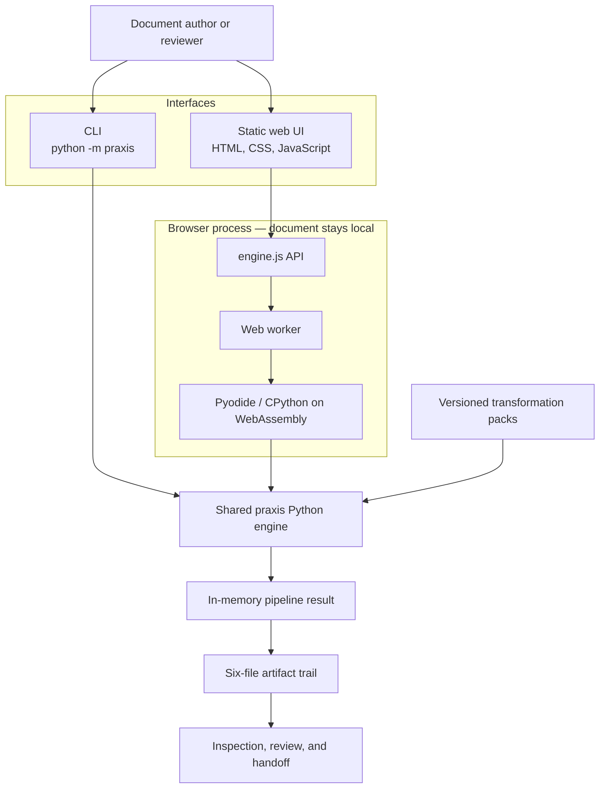
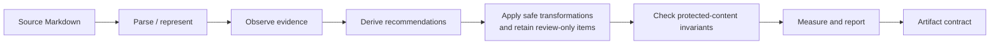

# Architecture

Praxis is one repository and one Python transformation engine exposed through two interfaces: a command-line harness and a static browser viewer. Keeping them together makes the viewer evidence of the engine's real behavior and gives both interfaces the same artifact contract.

## System view

The CLI reads and writes local files. The deployed viewer is static and executes the packaged Python source inside the user's browser. Praxis has no application server, account system, database, telemetry pipeline, or document-upload endpoint. Hosting serves the application assets, and the page requests its display font from Google Fonts; neither request includes document contents. The first local build downloads the pinned Pyodide runtime. Document processing itself stays inside the browser boundary.

## Pipeline and data flow

`praxis.pipeline.run_pipeline(text, pack_id)` is the shared orchestration boundary. It selects a pack, invokes named operations, and returns a JSON-serializable result. Persistence belongs to each interface: the CLI writes a directory, while the browser renders the result and can create a downloadable zip.

## Components and boundaries

| Component | Responsibility | Boundary |
| --- | --- | --- |
| `praxis/pipeline.py` | Orchestrates one complete run and returns its result. | Contains no CLI, browser, or persistence concerns. |
| `praxis/packs.py` and `praxis/rules.py` | Define pack registry behavior; observe, recommend, and transform. | Packs select domain rules; the interfaces do not duplicate them. |
| `praxis/validation.py` | Checks protected tokens and applies explicit validation status. | Provides conservative evidence, not proof of semantic equivalence. |
| `praxis/report.py` and `praxis/metrics.py` | Produce review-facing reports and before/after measurements. | Consume pipeline results; they do not decide edits. |
| `praxis/cli.py` | Reads an input path and writes artifact files. | Thin adapter over `run_pipeline`. |
| `web/src/engine.js` | Presents `runPipeline` and zip-download operations to the UI. | Keeps Pyodide details out of the rest of the UI. |
| `web/src/worker.js` | Loads the Python package in Pyodide and runs it off the UI thread. | The browser/Python bridge; it must preserve the CLI artifact contract. |
| `scripts/build_site.sh` | Assembles the static site, Python sources, examples, and pinned Pyodide runtime. | Build-time packaging only; it is not an application backend. |

## Artifact contract

Every successful run exposes the following six durable artifacts:

| File | Contract |
| --- | --- |
| `observations.json` | Evidence found in the source, including rule identity and location. |
| `recommendations.json` | Proposed actions derived from observations. |
| `transformations.json` | Applied and review-only changes, with provenance and validation status. |
| `validation.json` | Overall status and invariant-check details. |
| `final.md` | The resulting document after safe transformations. |
| `report.md` | Human-readable metrics, validation summary, diff log, and final document. |

The browser's downloaded zip is intended to contain byte-identical file contents to a CLI run with the same source and pack. Changes to filenames, JSON shapes, formatting, or newline behavior are therefore contract changes and must be validated across both interfaces.

## Vocabulary

| Term | Meaning |
| --- | --- |
| Document | Source content being analyzed or transformed. |
| Pass | Named operation with explicit inputs and outputs. |
| Observation | Evidence detected in the document. |
| Recommendation | Proposed action derived from an observation. |
| Transformation | An applied edit or a recorded review-only action. |
| Validation | A check that protected invariants survived transformation. |
| Artifact | Persisted intermediate or final output. |
| Transformation pack | Versioned domain rules selected for a run. |

## Privacy and trust boundary

In the viewer, source text and pipeline results remain in browser memory unless the user explicitly downloads the artifact zip. Praxis does not provide accounts, backend storage, or server processing. The static host and Google Fonts can observe ordinary asset requests, but no code sends them document contents. Users with stricter privacy or supply-chain requirements can clone the repository, inspect the source, remove the external font dependency if needed, and build or run Praxis locally.

The artifact trail improves auditability; it does not make every transformation correct. Reviewers should inspect evidence, skipped or review-only changes, validation output, and the final document before accepting a result.

## Non-goals

- Splitting the CLI and viewer into separate repositories or maintaining two engines.
- Claiming semantic equivalence from token-preservation checks.
- Providing collaborative editing, accounts, cloud storage, or a hosted processing API.
- Acting as a general-purpose or production-polished editor today.
- Applying judgment-heavy recommendations automatically without review.
- Treating pack metadata YAML as a second runtime implementation; the Python registry remains authoritative.
